# Dependency Graph & Component Relationships

## 1. Application Component Hierarchy

```mermaid
graph TD
    subgraph Root
        Index[index.js] --> SettingsProvider[contexts/SettingsContext.jsx]
        SettingsProvider --> App[App.js]
        App --> AppRoutes[routes/AppRoutes.jsx]
    end

    subgraph Pages & Routes
        AppRoutes --> HomePage[pages/Home.jsx]
        AppRoutes --> SettingsPage[pages/Settings.jsx]
        AppRoutes --> Feed[features/feed/components/Feed.jsx]
        AppRoutes --> Profile[features/profile/components/Profile.jsx]
        AppRoutes --> ArticleReading[features/article/components/ArticleReading.jsx]
        AppRoutes --> PostReading[features/post/components/PostReading.jsx]
        AppRoutes --> LoginForm[features/auth/components/LoginForm.jsx]
        AppRoutes --> SignupForm[features/auth/components/SignupForm.jsx]
    end

    subgraph Layout Components
        HomePage --> Content[components/layout/Content.jsx]
        HomePage --> Sidebar[components/layout/Sidebar.jsx]
        Content --> QuoteSlider[components/common/QuoteSlider.jsx]
        Content --> Feed
        Content --> Writer[features/writer/components/Writer.jsx]
        Feed --> Top[components/layout/Top.jsx]
        Feed --> Sidebar
        Profile --> Top
        Profile --> Sidebar
        ArticleReading --> Top
        PostReading --> Top
        PostReading --> Sidebar
        SettingsPage --> SettingsLayout[features/settings/components/SettingsLayout.jsx]
        SettingsLayout --> Top
    end

    subgraph Feature Decomposition
        Feed --> FeedList[features/feed/components/FeedList.jsx]
        FeedList --> FeedItem[features/feed/components/FeedItem.jsx]
        FeedItem --> PostCard[features/feed/components/PostCard.jsx]
        FeedItem --> ArticleCard[features/feed/components/ArticleCard.jsx]
        PostCard --> FeedUser[features/feed/components/FeedUser.jsx]
        PostCard --> FeedActions[features/feed/components/FeedActions.jsx]

        Profile --> ProfileHeader[features/profile/components/ProfileHeader.jsx]
        Profile --> ProfileInfo[features/profile/components/ProfileInfo.jsx]
        Profile --> ProfileStats[features/profile/components/ProfileStats.jsx]
        Profile --> ProfileTabs[features/profile/components/ProfileTabs.jsx]
        Profile --> ProfileEditModal[features/profile/components/ProfileEditModal.jsx]
        Profile --> FeedList

        ArticleReading --> ArticleHeader[features/article/components/ArticleHeader.jsx]
        ArticleReading --> ArticleBody[features/article/components/ArticleBody.jsx]
        ArticleReading --> ArticleActions[features/article/components/ArticleActions.jsx]

        PostReading --> PostHeader[features/post/components/PostHeader.jsx]
        PostReading --> PostBody[features/post/components/PostBody.jsx]
        PostReading --> PostActions[features/post/components/PostActions.jsx]

        Writer --> WriterToolbar[features/writer/components/WriterToolbar.jsx]
        Writer --> WriterEditor[features/writer/components/WriterEditor.jsx]
        Writer --> WriterImages[features/writer/components/WriterImages.jsx]
        Writer --> WriterActions[features/writer/components/WriterActions.jsx]
    end
```

---

## 2. Hooks, Services & Context Relationships

```mermaid
graph TD
    subgraph Contexts
        SettingsContext[contexts/SettingsContext.jsx]
    end

    subgraph Custom Hooks
        useAuth[hooks/useAuth.js]
        useSocket[hooks/useSocket.js]
        useQuoteSlider[hooks/useQuoteSlider.js]
        useCommentForm[hooks/useCommentForm.js]
        useAuthForm[features/auth/hooks/useAuthForm.js]
        useFeed[features/feed/hooks/useFeed.js]
        useArticle[features/article/hooks/useArticle.js]
        usePost[features/post/hooks/usePost.js]
        useProfile[features/profile/hooks/useProfile.js]
        useWriter[features/writer/hooks/useWriter.js]
    end

    subgraph Service Layer
        apiService[services/api.service.js]
        firebaseAuth[services/firebaseAuth.service.js]
        firebaseStorage[services/firebaseStorage.service.js]
        storageService[services/storage.service.js]
        settingsService[services/settings.service.js]
        authService[features/auth/services/auth.service.js]
        feedService[features/feed/services/feed.service.js]
        articleService[features/article/services/article.service.js]
        postService[features/post/services/post.service.js]
        profileService[features/profile/services/profile.service.js]
        writerService[features/writer/services/writer.service.js]
    end

    subgraph External Backend
        REST[REST API Server]
        SocketServer[Socket.io Server]
        FirebaseAuthBackend[Firebase Auth Project]
        FirebaseStorageBackend[Firebase Storage Bucket]
    end

    SettingsContext --> settingsService
    settingsService --> apiService
    apiService --> REST

    useAuthForm --> authService
    authService --> firebaseAuth
    authService --> REST
    firebaseAuth --> FirebaseAuthBackend

    useFeed --> feedService
    useFeed --> useSocket
    feedService --> SocketServer
    useSocket --> SocketServer

    useProfile --> profileService
    profileService --> firebaseStorage
    profileService --> REST
    firebaseStorage --> FirebaseStorageBackend

    useWriter --> writerService
    writerService --> storageService
    writerService --> REST
    storageService --> firebaseStorage

    useCommentForm --> storageService
    useCommentForm --> REST

    useArticle --> articleService
    usePost --> postService
    usePost --> SocketServer
    useQuoteSlider --> wisdoms[assets/data/wisdoms1.json]
```

---

## 3. Data Flows

### 3.1 Authentication & Session Management
1. User enters credentials or clicks Google sign-in via `LoginForm` / `SignupForm`.
2. `useAuthForm` triggers `authService.signInWithCredentials()` or `authService.signInWithGoogle()`.
3. JWT token is stored via `cookies.js` (if Remember Me) or `localStorage.setItem("token")`.
4. User profile object is serialized in `localStorage.setItem("me")`.
5. `api.service.js` interceptor automatically attaches `Authorization: Bearer <token>` to all subsequent REST requests.

### 3.2 Real-time Content Feed
1. `Feed.jsx` mounts `useFeed(type, userId)`.
2. `useFeed` establishes a singleton connection via `useSocket`.
3. Emits `GET_FEED` via `feed.service.js` with cursor pagination.
4. Server responds with `FEED_RESULT`; `useFeed` filters duplicates using `seenIds` Set and updates local React state.
5. Live posts broadcast via `NEW_POST` event prepend dynamically to the active feed stream.

### 3.3 Content Creation (Posts, Articles, Novels)
1. User opens `Writer.jsx` floating action trigger.
2. Form state, rich text (`CKEditor`), and multi-image queue managed by `useWriter.js`.
3. On publish, images are uploaded in parallel to Firebase Storage via `storage.service.js`.
4. Resulting download URLs and rich content are dispatched to `/saveIdeas` or `/saveArticle_novels` via `writer.service.js`.

### 3.4 User Profile & Avatar Cropping
1. `Profile.jsx` initializes `useProfile.js`, querying user stats and bio via `profile.service.js`.
2. Follower counts synchronize in real-time via `newFollower` and `lostFollower` socket events.
3. User selects a local image; `ProfileEditModal.jsx` crops image canvas with `react-easy-crop`.
4. `useProfile.js` converts cropped area to JPEG blob and uploads to Firebase Storage (`ImagesProfile/image${userId}.jpg`).
5. URL is saved to the database via `/editProfile` REST endpoint.

### 3.5 Global Settings Synchronization
1. `SettingsProvider` mounts at application root (`src/index.js`).
2. Fetches saved user preferences from `/settings` via `settings.service.js`.
3. Injects custom attributes to `document.documentElement`:
   - `data-theme`: `"light"` | `"dark"`
   - `data-font-size`: `"small"` | `"medium"` | `"large"`
   - `dir`: `"rtl"` (Arabic) | `"ltr"` (English)
   - `--font-primary`: Dynamic font family CSS property
4. Modifying preferences triggers `saveSettings()`, queuing updates via debounced PUT `/settings`.
